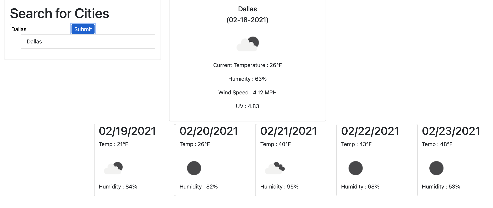

# weatherDash

## Summary 
``` 
With  JS, CSS, and HTML, a weather dashboard was created with bootstrap as the framework. If you type in a city, you will be able to see the current and future weather conditions for the city.

```

## Image 




## Technologies 

```
VS Code was used primarily 
The browser is used to execute the file
```

## GitHub Links
```
https://github.com/ashleyhayjin/weatherDash

https://ashleyhayjin.github.io/weatherDash/


```
